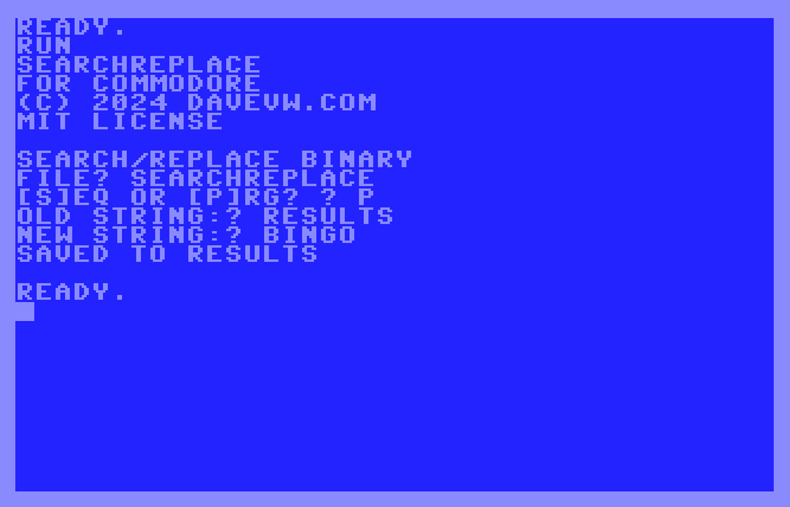

# Search & Replace in binary file for Commodore #

Streams a file (seq or prg) from disk 8 replacing all occurances of *old* text with *new* text

* new text can be larger than old, or vice versa, or same length
* does work with BASIC files, as Commodore 64 will relink on load
* won't work with machine code or fixed data if change length as addresses/offsets will be off
* limited error checking
* should work with most 8-bit Commodores, written in generic BASIC

(c) 2024 Dave Van Wagner davevw.com
Open Source MIT License

